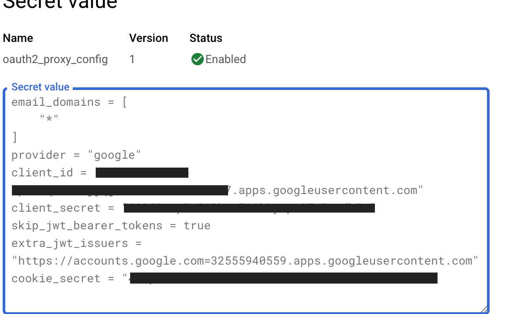
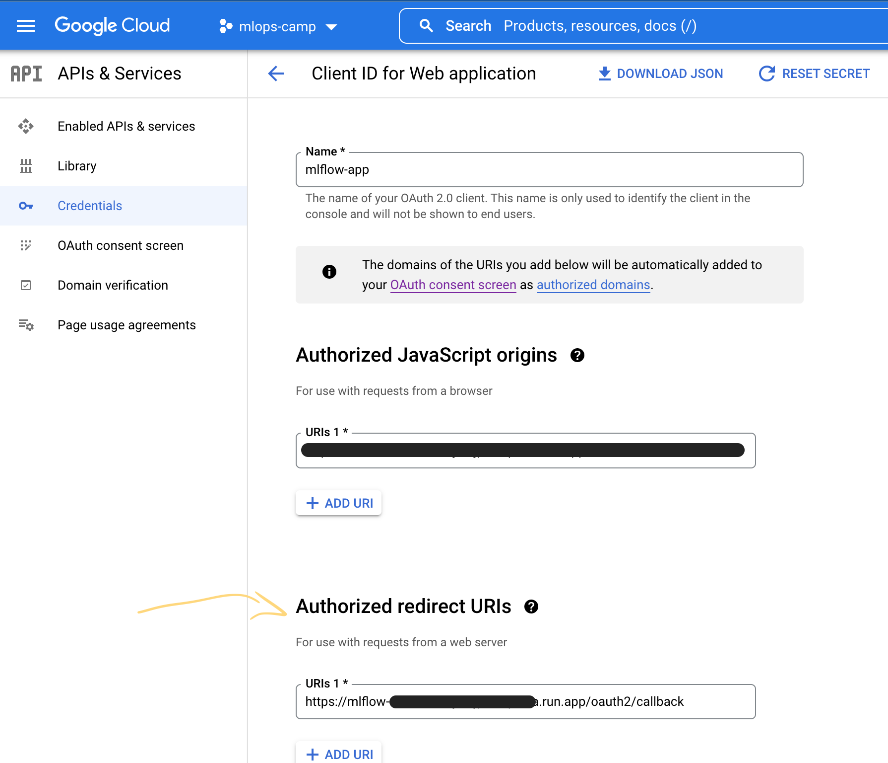

# **SERVERLESS MLFLOW ON GOOGLE CLOUD PLATFORM**

**Bootstrapped / chopped n screwed from https://github.com/artefactory/one-click-mlflow*

Also see:
- [Serverless mlflow using Cloud Run](https://getindata.com/blog/deploying-serverless-mlflow-google-cloud-platform-using-cloud-run/)
- [Setting up mlflow on GCP](https://medium.com/@Sushil_Kumar/setting-up-mlflow-on-google-cloud-for-remote-tracking-of-machine-learning-experiments-b48e0122de04)

___

### **BUILD DOCKER IMAGE**
___

- [See container registry info here](https://cloud.google.com/container-registry/docs/pushing-and-pulling)


- [Dockerfile](mlflow_server/Dockerfile) we are building

Tagging with version of mlflow being installed.

```bash
docker build -t mlflow:1.22.0 .
```

Tag your local image with registry name
```
docker tag mlflow:1.22.0 gcr.io/mlops-camp/mlflow:1.22.0
```

Push image to registry
```
docker push gcr.io/mlops-camp/mlflow:1.22.0
```

## **SETUP DEPENDENCIES**
___

Open terminal in [IaC/dependencies](IaC/dependencies/) and run `terraform apply`. You will need to provide the following variables (easiest to set in terraform.tfvars file):
- `backend_bucket`
- `project_id`

This will create a cloud storage bucket to securely store your terraform state and enable the necesary APIs required in the project specified.


## **CREATE SECRET FOR OAUTH2_PROXY_CONFIG**
___

This was done manually -- I am sure there is a better way to set this up in a more automated fashion...


- Create secret using terraform by reading in config file?
- Set config variables as environment variables in cloud run?

Still had to manually setup Oauth consent screen and create credentials for OAuth2.0 client as was unable to find a way for Terraform to create.

Can generate a cookie secret using Terraform (random_password) or using bash command
```bash
dd if=/dev/urandom bs=32 count=1 2>/dev/null | base64 | tr -d -- '\n' | tr -- '+/' '-_'; echo
```



## **DEPLOY APP USING CLOUD RUN**
___

With the depenencies setup and the oauth2_proxy_config secret set you should be able to create and deploy mlflow application  with cloud run using Terraform. 

- Supply necessary variables for Terraform (see [terraform.tfvars.sample](IaC/terraform.tfvars.sample) for an example.)

- Run `terraform apply`

Will output the url you will be able to access mlflow app from. 

Has the form `https://{route-hash}-{project-hash}-{cluster-level-suffix}.a.run.app`

You will need to add this url as an authorized redirect URI under your Oauth2.0 Client ID configuration


___

## **CHECK OUT MLFLOW WEB UI**
:tada:

Head to the url of your app e.g. `https://<redacted>.a.run.app`

You should be prompted to sign in using SSO with your google account. Upon sucess you should land on the mlflow app!

